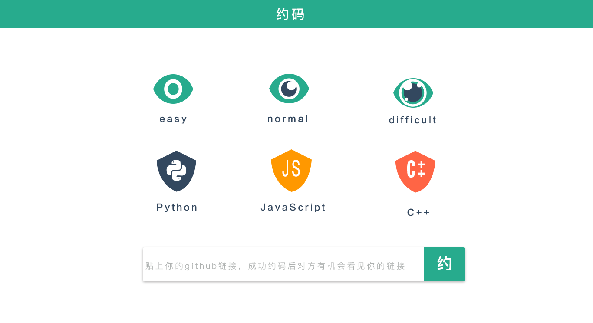
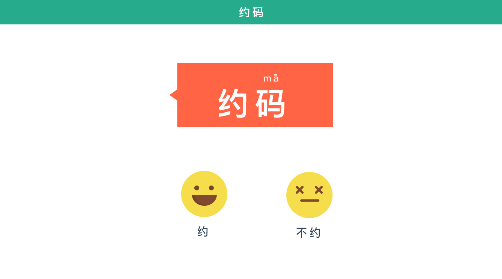

##约码?
###项目描述
这是一个程序员交♂友♂平台。由于程序员圈子比较局限，所以我们推出该平台帮程序员约代码并认识陌生程序员。在无法沟通的情况下，两人将协同解决同一问题。只有默契解决问题后，才会公开个人信息，方便进一步的交♂流♂。

###团队成员
- [林家军](https://github.com/cubarco)
- [梁佳林](https://github.com/evshiron)
- [黄煜勤](http://www.zcool.com.cn/u/2730168)
- [孟涛](https://github.com/mtunique)
- [王明晓](https://github.com/assuming)

###产品浏览

